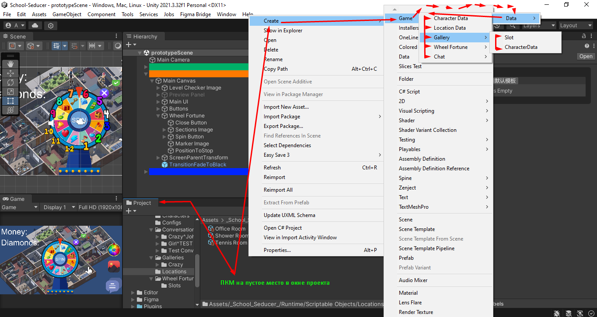
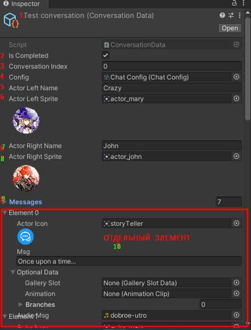
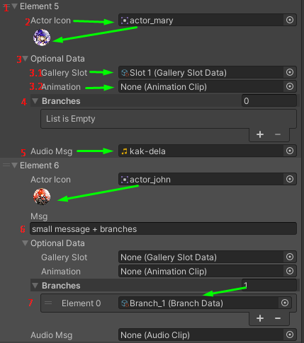
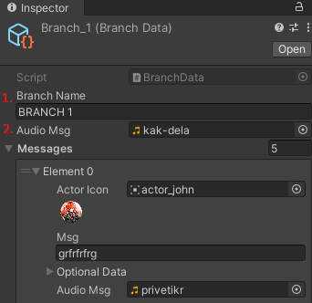
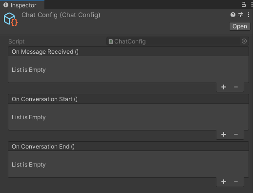
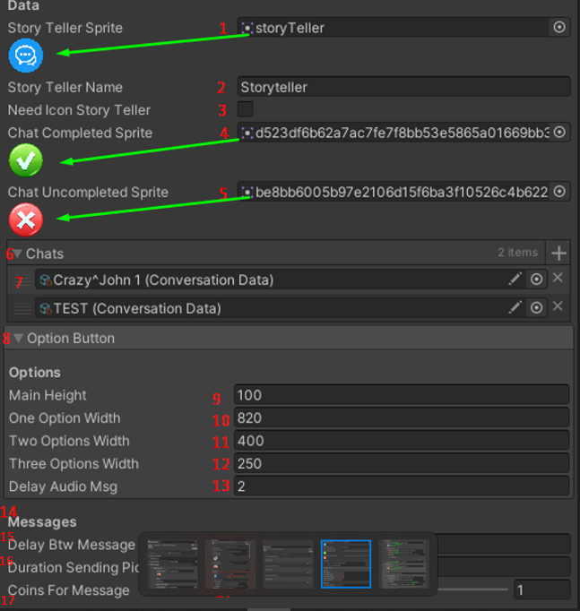
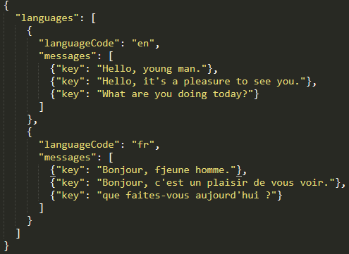
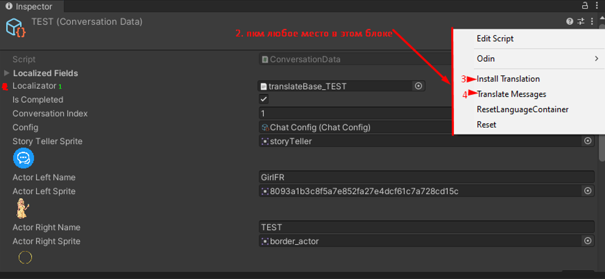
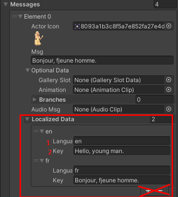

# Документация к College Fuck Fest
Версия Unity: 2021.3.32f1

### Содержание:
- [Иерархия проекта](#иерархия-проекта)
- [Диалог](#диалог)
- [Сообщения](#сообщения)
- [Разветвления](#разветвления)
- [Общая конфигурация чата](#общая-конфигурация-чата)
- [Локализация](#локализация)
- [Нельзя делать](#нельзя-делать)
---

## Иерархия проекта
Далее все Prefabs и Scriptable Objects(SO) будут представлены в главной папке: *_School_Seducer_/Runtime/*
- Глобальный конфиг по пути: Runtime/SO/Configs/Global Settings
- Общая конфигурация чата по пути: Runtime/SO/Configs/Chat Config
- Диалоги по пути: Runtime/SO/Conversations/*Выбираем папку диалога*/*Выбираем диалог*
- Сообщения по пути: Runtime/SO/Conversations/*Выбираем папку диалога*/***Выбираем диалог*** -> Список сообщений в инспекторе выбранного диалога
- Разветвления по пути: Runtime/SO/Conversations/*Выбираем папку диалога*/Branches
- Скриншот ниже показывает как создавать SO всех возможных конфигураций, разложенных по полочкам  

## Диалог
Открываем диалог(SO) и видим следующие конфигурируемые параметры:  
1.  Название диалога (*не влияет на геймплей*)
2.  Чек-бокс о завершении диалога игроком (WIP)
3.  Индекс диалога для прогресса диалога (WIP)
4.  Общая конфигурация чата
5.  Имя персонажа *слева* в чате
6.  Иконка персонажа *слева* в чате
7.  Имя персонажа *справа* в чате
8.  Иконка персонажа *справа* в чате
9.  Список всех сообщений   

## Сообщения
Сперва необходимо открыть нужный диалог (см. [Иерархия проекта](#иерархия-проекта))  
Открываем раскрывающийся список 9 пункт диалога (см. [Диалог](#диалог))  
Видим следующие конфигурируемые параметры каждого сообщения:  
  
**Зелёные стрелочки = подсказки**  
1.  Индекс элемента сообщения (нумерация начинается с нуля)  
Определяет порядок расстановки сообщений
  
2.  Иконка персонажа  
3.  Данные по выбору (опционально)  
  3.1 Слот галереи определяет использовать текстовое сообщение или показать картинку/анимацию  
  3.2 Будет перенесён в слот галереи (WIP)
    
4.  Количество веток разветвления  
**!ВАЖНО!** максимум может быть 3 ветки  
5.  Можно проиграть аудио сообщение, если поле не None (не пустое)  
6.  Текст для сообщения  
**!ВАЖНО!** может быть применено, если слот галереи пустой. Для удобности поле сообщения иначе скрывается.  
7.  SO ветка, считается полем для веток (см. [Разветвления](#разветвления))  
**!ОЧЕНЬ ВАЖНО!**  
Ветки можно выбирать только ***ПОСЛЕДНЕМУ*** сообщению в списке диалога. Иначе будут ошибки, удалятся все сообщения после попытки выбрать ветку и возможно собъётся кто будет отправителем сообщения.  
  

***Как выбирать отправителя***  
Для этого необходимо скопировать иконку нужного персонажа из пунктов 6, 8, или рассказчика, конкретно **Диалога/Разветвления** кликнув ПКМ по ней и выбрать команду *Copy*    
Далее необходимо выбрать иконку персонажа желаемого сообщения (см. пункт 2), нажать ПКМ и выбрать команду *Paste*  

## Разветвления  
*Далее разветвления = ветки*  
  
Можно выбрать количество разветвлений в пункте 4 у сообщения (см. [Сообщения](#сообщения))  
Представляют из себя примерно похожее на диалог, но с небольшими отличиями, которые стоит уточнить:  
1.  Название ветки (влияет на название выбора разветвления)  
2.  Аудио сообщение проиграется (возможна задержка) после появления сообщения как выбранной ветки игроком.  
  
Задержка настраивается в общей конфигурации чата (см. [Иерархия проекта](#иерархия-проекта)).  
Необходимо выбрать раскрывающийся элемент *Option Button*, найти поле *Delay Audio Msg* и указать задержку (по умолчанию 2 секунды)  
- в секундах если 1.0, 2.0 или 1, 2  
- в милисекундах если 0.5, 0.8 или .5, .8  
  

## Общая конфигурация чата
Находится в иерархии проекта (см. [Иерархия проекта](#иерархия-проекта))  
  
---*WIP*---  
  
***ОПЫТНЫМ ПОЛЬЗОВАТЕЛЯМ***  
Как только заходим в данный SO, мы увидим данные раскрывающиеся списки (далее *События*), которые представляют собой элементы действий по названию события  
*Например:* по событию *OnMessageReceived* можно указать действия, которые будут выполнены по добавлению сообщения в чат  
***ОПЫТНЫМ ПОЛЬЗОВАТЕЛЯМ***  
  
---*WIP*---  
  
  
Далее находятся параметры для настройки общих данных чата:  
1.  Иконка рассказчика как отправителя сообщений  
2.  Имя рассказчика как отправителя сообщений  
3.  Чек-бокс на выбор использования иконки рассказчика (***БУДЕТ УБРАНО***)  
4.  Иконка статуса *завершённого* чата  
5.  Иконка статуса *не завершённого* чата  
6.  Список всех чатов (обязательно нужно заполнить для сбора прогресса за чатами WIP)  
7.  Поле для выбора SO конкретного чата  
8.  Общие данные по нажатию на выбор разветвления
  
Далее имеется в виду кнопка(-и) разветвления. На одну из них игрок может нажать для выбора разветвления  
9.  Высота каждой кнопки  
10.  Ширина кнопки одного разветвления  
11.  Ширина кнопок двух разветвлений  
12.  Ширина кнопок трёх разветвлений  
13.  Задержка аудио сообщения у разветвления (см. пункт 2 [Разветвления](#разветвления))  
14.  Общие данные по сообщениям в чате  
15.  Задержка отправления сообщения  
16.  Длительность отправки сообщения (до текста Picture/Animation sent)  
17.  **Реализация будет убрана**  

## Локализация  

Вся локализация всех конфигов переключается на другой язык в глобальном конфиге (см. [Иерархия проекта](#иерархия-проекта))  
Для переключения используется раскрывающийся список - *Current Language*  

### Диалоги и разветвления  
  
*Рекомендация*  
Создавать SO диалога/разветвления лучше через контекстное меню, чем копировать существующий и менять данные.  
  
Как только мы открываем SO от диалога/разветвления, то сверху мы видим следующую информацию по мере выполнения пунктов:  
1. Localizator - поле, которое предназначено для установки файла в виде JSON (структура файла JSON будет ниже).  
  
**!ВАЖНО!** Проводить инициализацию перевода можно только в пустое поле Localizator.  
  
2. Далее необходимо провести инициализацию локализатора. Для этого нужно нажать на верхний блок диалога/разветвления. Откроется контекстное меню с выбором команд.  
3. Для инициализации необходимо выбрать команду *Install Translation*  
4. После этого можно вручную провести перевод всех сообщений в зависимости от файла в Localizator. Для этого необходимо нажать команду *Translate Messages*  

### Сообщения в чате  

Для того, чтобы удостовериться, что локализация успешно применилась для сообщений, можно раскрыть поле *LocalizedData* и увидеть следующую информацию:  
1.  Language - код языка должен состоять из 2 букв нижнего регистра  
2.  Key - перевод сообщения в зависимости от языка  
  
  
## Нельзя делать
- Менять название папки Branches  
- Добавлять разветвления не к последнему сообщению  
- Категорически нельзя копировать файл диалога/разветвления и не устанавливать в поле Localizator как в пустое поле, иначе нельзя будет провести инициализацию
